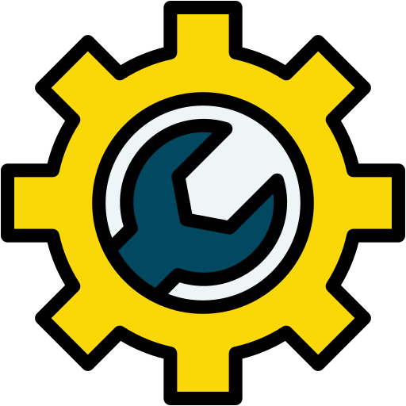
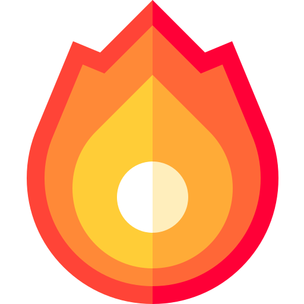
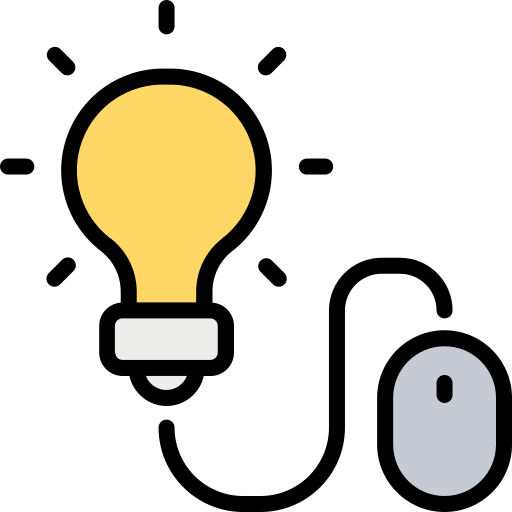

<!-- README.md para o perfil do GitHub -->

  

 

  I'm currently completing my degree in Computer Engineering at FEUP (Faculty of Engineering, University of Porto).  
  In my free time, I enjoy building small personal projects that allow me to explore new technologies and sharpen my skills beyond the classroom.

💻 Software Developer with a strong focus on impactful solutions;  
🚀 Passionate about entrepreneurship, innovation, and solving real-world problems;  
💪 Fitness enthusiast;

 

---

##  Featured Projects

---

##  Technologies & Tools

---

##  GitHub Stats
 

  
  

 

  
📈 Detailed Metrics

  <!-- Streak Stats -->
  ##  Streak Stats
  

    
  

   

  <!-- Activity Graph -->
  ##  Activity Graph
  

    
  

   

  <!-- GitHub Trophies -->
  ##  GitHub Trophies
  

    
  

---

##  Certificates

-  &nbsp; Complete C and C++ Language Course – Beginner to Advanced;
-  &nbsp; Complete Web Development – 20 Courses + 20 Projects;
-  &nbsp; Communication and Public Speaking;
-  &nbsp; English Online C1;

---

> _"Why not me? "_ – Frances Tiafoe
